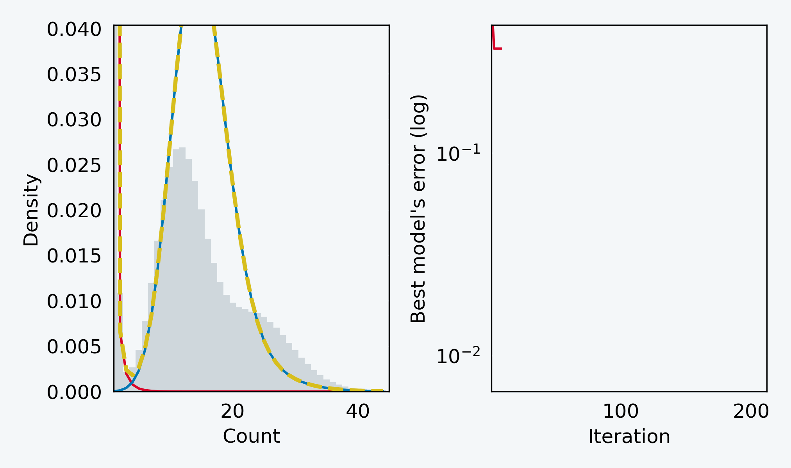

ntStat is a toolkit that uses Bloom filters to track both *k*-mer count and depth information for use in downstream applications. ntStat also models the *k*-mer count histogram using a mixture model, and infers valuable insights about the genome (size and heterozygosity), sequencing data (ratio of non-erroneous *k*-mers), and individual *k*-mers (probability of a *k*-mer being erroneous, given its count), *de novo*.

**Contents**
- [Installation](#installation)
  - [From source](#from-source)
- [Dependencies](#dependencies)
  - [General dependencies](#general-dependencies)
  - [C++ libraries](#c-libraries)
  - [Python packages](#python-packages)
- [Modules](#modules)
  - [`count`](#count)
  - [`filter`](#filter)
  - [`query`](#query)
  - [`hist`](#hist)
- [Credits](#credits)
- [License](#license)

# Installation

## From source

- Make sure all [dependencies](#dependencies) are available in the setup environment.
- Download the latest [release tarball](https://github.com/bcgsc/ntStat/releases)
- Install ntStat using `meson` by running the following commands in the project's root directory:

```shell
meson setup build
meson install -C build
```

Optional: Add `--destdir PREFIX` to `meson install` to change the installation path prefix to `PREFIX`, containing the `bin` directory for the main executable and `lib` for the modules.

# Dependencies

To install all dependencies in a fresh conda environment called `ntstat`:

```shell
conda env create --file environment.yaml
```

## General dependencies

- [Meson](https://mesonbuild.com/Quick-guide.html) and a C++ compiler with C++17 support, only required for installation
- Python >= 3.9
- [ntCard](https://github.com/bcgsc/ntCard)

## C++ libraries

- [btllib](https://github.com/bcgsc/btllib) >=1.7.3
- [argparse](https://github.com/p-ranav/argparse)
- [pybind11](https://github.com/pybind/pybind11)

## Python packages
```
kneed
matplotlib
numpy
pandas
scikit-learn
scipy
tabulate
tqdm
```

# Modules

## `count`

Calculate TF-IDF information from sequencing data. This module outputs two counting Bloom filters: One for *k*-mer/seed counts (TF) and other for depths (DF). The number of reads will also be printed to stdout.

```
Usage: ntstat count [--help] [--version] [-k VAR] [-s VAR] -f VAR [-e VAR] [-b VAR] [--long] [-t VAR] -o VAR reads

Positional arguments:
  reads          path to sequencing data file(s) [nargs: 0 or more] [required]

Optional arguments:
  -h, --help     shows help message and exits 
  -v, --version  prints version information and exits 
  -k             k-mer length 
  -s             path to spaced seeds file (one per line, if -k not specified) 
  -f             path to k-mer spectrum file (from ntCard) [required]
  -e             target output false positive rate [nargs=0..1] [default: 0.0001]
  -b             size of each output CBF (bytes) 
  --long         optimize for long read data 
  -t             number of threads [nargs=0..1] [default: 1]
  -o             path to store output file [required]
```

- Set `-s` to count spaced seeds instead of *k*-mers. `-k` will be ignored in this case. The file pointed to by `-s` should be a plain text file containing spaced seed patterns, one per line, with `1` for care and `0` for don't care positions.
- `-f` should point to the histogram file generated by [ntCard](https://github.com/bcgsc/ntCard). Use the same `-k` for ntCard and ntStat. For spaced seeds, set ntCard's `-k` parameter to the seed length.
- Use `-b` to manually set the output data structure's size. Alternatively, set `-e` to the desired false positive rate (0.0001 by default) and ntStat will automatically calculate a suitable value for `-b`.

## `filter`

Gathers *k*-mer counts ONLY and saves *k*-mers that occur at least `-cmin` times and at most `-cmax` times in a Bloom filter. Optionally, output can be a counting Bloom filter (set `--counts`), which includes the filtered *k*-mers' counts, resulting in a 8x larger output file.

```
Usage: ntstat filter [--help] [--version] [-k VAR] [-s VAR] -f VAR [-e VAR] [-b VAR] [-cmin VAR] [-cmax VAR] [--counts] [--long] [-t VAR] -o VAR reads

Positional arguments:
  reads          path to sequencing data file(s) [nargs: 0 or more] [required]

Optional arguments:
  -h, --help     shows help message and exits 
  -v, --version  prints version information and exits 
  -k             k-mer length 
  -s             path to spaced seeds file (one per line, if -k not specified) 
  -f             path to k-mer spectrum file (from ntCard) [required]
  -e             target output false positive rate [nargs=0..1] [default: 0.0001]
  -b             output BF/CBF size (bytes) 
  -cmin          minimum count threshold (>=1) [nargs=0..1] [default: 1]
  -cmax          maximum count threshold (<=255) [nargs=0..1] [default: 255]
  --counts       output counts (requires ~8x RAM for CBF) 
  --long         optimize for long read data 
  -t             number of threads [nargs=0..1] [default: 1]
  -o             path to store output file [required]
```

- Refer to the `count` module's notes for information about the parameters.

## `query`

Converts information from a BF/CBF to TSV format.

```
usage: ntstat query [-h] -b B [-s S] -o O data [data ...]

positional arguments:
  data        path to query data

options:
  -h, --help  show this help message and exit
  -b B        path to BF/CBF file
  -s S        path to spaced seeds file
  -o O        path to output TSV file
```

- The input data can be any FASTA, FASTQ, or BAM. Compressed files are supported. To read from stdin, use `-`.
- If the data structure contains spaced seed information, pass the path to the spaced seeds text file to `-s`.

## `hist`

Fits a mixture model to the *k*-mer count histogram to estimate *k*-mer error and heterozygous probabilities, genome size, and thresholds useful for the `filter` command.

```
usage: ntstat hist [-h]
               [-f {asciidoc,double_grid,double_outline,fancy_grid,fancy_outline,github,grid,heavy_grid,heavy_outline,html,jira,latex,latex_booktabs,latex_longtable,latex_raw,mediawiki,mixed_grid,mixed_outline,moinmoin,orgtbl,outline,pipe,plain,presto,pretty,psql,rounded_grid,rounded_outline,rst,simple,simple_grid,simple_outline,textile,tsv,unsafehtml,youtrack}]
               [-m STYLE] [-t TITLE] [--y-log | --no-y-log] [-r PLOT_RANGE] [-o PLOT] [--probs PROBS] [--fit-gif FIT_GIF] [-c CONFIG] [--no-model]
               path

positional arguments:
  path                  k-mer spectrum file (from ntCard)

options:
  -h, --help            show this help message and exit
  -f {asciidoc,double_grid,double_outline,fancy_grid,fancy_outline,github,grid,heavy_grid,heavy_outline,html,jira,latex,latex_booktabs,latex_longtable,latex_raw,mediawiki,mixed_grid,mixed_outline,moinmoin,orgtbl,outline,pipe,plain,presto,pretty,psql,rounded_grid,rounded_outline,rst,simple,simple_grid,simple_outline,textile,tsv,unsafehtml,youtrack}, --table-format {asciidoc,double_grid,double_outline,fancy_grid,fancy_outline,github,grid,heavy_grid,heavy_outline,html,jira,latex,latex_booktabs,latex_longtable,latex_raw,mediawiki,mixed_grid,mixed_outline,moinmoin,orgtbl,outline,pipe,plain,presto,pretty,psql,rounded_grid,rounded_outline,rst,simple,simple_grid,simple_outline,textile,tsv,unsafehtml,youtrack}
                        stdout table format
  -m STYLE, --style STYLE
                        matplotlib style file, url, or one of available style names: ntstat.hist.default, ntstat.hist.paper, Solarize_Light2, _classic_test_patch, _mpl-gallery, _mpl-gallery-nogrid,
                        bmh, classic, dark_background, fast, fivethirtyeight, ggplot, grayscale, seaborn-v0_8, seaborn-v0_8-bright, seaborn-v0_8-colorblind, seaborn-v0_8-dark, seaborn-v0_8-dark-
                        palette, seaborn-v0_8-darkgrid, seaborn-v0_8-deep, seaborn-v0_8-muted, seaborn-v0_8-notebook, seaborn-v0_8-paper, seaborn-v0_8-pastel, seaborn-v0_8-poster, seaborn-v0_8-talk,
                        seaborn-v0_8-ticks, seaborn-v0_8-white, seaborn-v0_8-whitegrid, tableau-colorblind10
  -t TITLE, --title TITLE
                        title to put on plot
  --y-log, --no-y-log   plot y-axis in log scale
  -r PLOT_RANGE, --plot-range PLOT_RANGE
                        plot x-axis limits (inclusive) separated by a colon, i.e., use a:b to show results in the range [a, b]. 'auto' will automatically adjust the limits for better visibility.
  -o PLOT, --plot PLOT  path to output plot
  --probs PROBS         path to output probabilities in csv format
  --fit-gif FIT_GIF     path to output model fit history animation
  -c CONFIG, --config CONFIG
                        path to differential evolution config file (json)
```

- ntStat prints comprehensive information about the model, dataset, and *k*-mers. This information can be in various formats supported by the [tabulate](https://github.com/astanin/python-tabulate) package, set by the `-f` parameter.
- The differential evolution algorithm's parameters can be controlled by a JSON file passed to `-c`. Refer to [scipy's documentation](https://docs.scipy.org/doc/scipy/reference/generated/scipy.optimize.differential_evolution.html) for information about these parameters. Example configuration for increasing exploration, in case ntStat fails to find a good model:

```JSON
{
    "popsize": 8,
    "init": "sobol",
    "mutation": [
        0.8,
        1.2
    ],
    "recombination": 0.5,
    "strategy": "best1bin"
}
```

- If the `-o/--plot` parameter is set, and points to a valid path for the output file, ntStat will plot the histogram, model, and estimated *k*-mer robustness rate, coverage, genome size, and heterozygosity. All matplotlib formats are supported (e.g., PNG, JPG, PDF).
- The output figure's title can be changed using the `-t` parameter. Title text can be italicized by putting words between `^`s (e.g., `^H. sapiens^ ONT, k=30`).
- Setting `--y-log` will plot the y-axis in log scale.
- Use `-r`  to limit the range of the plot's x-axis. ntStat can set a suitable maximum count for visibility (0.999 of the final negative binomial component) using `-r auto`.
- The model's output value for each *k*-mer count can be saved to a CSV file pointed by the `--probs` parameter.
- For debugging purposes and tweaking the DE algorithm's configuration (`-c`), the `--fit-gif` can be used to plot the best model in each iteration and save the plots as a GIF file pointed to by this parameter. Generating a GIF will take a few minutes to complete. Example of a fit history GIF generate  by ntStat:



# Credits

- [Parham Kazemi](https://github.com/p-kazemi)
- [Lauren Coombe](https://github.com/lcoombe)
- [René L Warren](https://github.com/warrenlr)
- Inanc Birol

# License

ntStat Copyright (c) 2024-present British Columbia Cancer Agency Branch.  All rights reserved.

ntStat is released under the GNU General Public License v3

This program is free software: you can redistribute it and/or modify it under the terms of the GNU General Public License as published by the Free Software Foundation, version 3.
 
This program is distributed in the hope that it will be useful, but WITHOUT ANY WARRANTY; without even the implied warranty of MERCHANTABILITY or FITNESS FOR A PARTICULAR PURPOSE. See the GNU General Public License for more details.

You should have received a copy of the GNU General Public License along with this program. If not, see <http://www.gnu.org/licenses/>.

For commercial licensing options, please contact Patrick Rebstein <prebstein@bccancer.bc.ca>